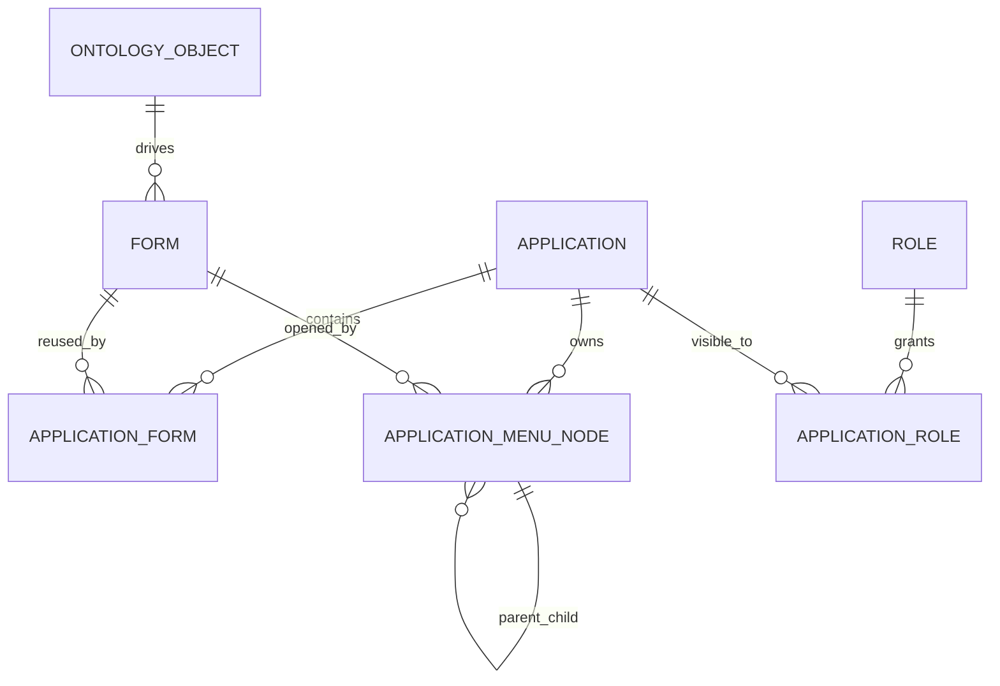

# ManuFoundry 低代码平台架构

> 更新时间：2026-05-19  
> 状态：产品结构和前端交互已成型，核心配置落库是下一阶段重点。

## 1. 平台定位

ManuFoundry 的低代码能力不是单纯的拖拽大屏，也不是传统后台 CRUD 生成器，而是面向制造业数据资产、本体对象、业务表单、流程和权限的一套配置平台。

目标链路：

```text
数据源
  -> 数据表 / 数据集 / 字段字典
  -> 本体对象 / 对象关系
  -> 表单配置
  -> 菜单装配
  -> 应用发布
  -> 普通用户使用
```

## 2. 用户视角

### 2.1 普通用户

普通用户主要消费应用和页面。

```text
顶部选择应用
  -> 左侧看到当前应用的菜单结构
  -> 打开某个业务页面
  -> 在页面标题栏使用新增、刷新、导出、设置等动作
```

普通用户不需要理解数据表、本体、菜单绑定等后台概念。

### 2.2 管理员

管理员负责配置平台。

```text
系统管理
  -> 应用与菜单
     -> 应用管理
     -> 表单管理
     -> 应用装配
  -> 数据资产与本体
  -> 用户管理
  -> 角色权限
```

管理员需要维护：

- 应用本身：名称、编码、图标、默认入口、可见角色。
- 表单本身：名称、编码、绑定本体对象、状态、字段配置。
- 应用和表单关系：一个应用有哪些可用表单，一个表单能被哪些应用复用。
- 菜单结构：当前应用下如何组织这些表单入口。
- 权限关系：哪些角色能看应用、菜单、表单、字段、按钮、流程动作。

## 3. 核心对象模型

### 3.1 应用 Application

应用是业务工作包。

```text
Application
  id
  name
  code
  description
  icon
  default_route
  status
  is_pinned
  sort_order
```

应用示例：

- 生产态势
- 预测性维护
- 质量分析
- 供应链风险

### 3.2 表单 Form

表单是业务对象页面的配置单元。后续表单会绑定本体对象，而不是直接绑定数据库表。

```text
Form
  id
  name
  code
  ontology_object_id
  source
  status
  owner
  description
  field_count
```

表单示例：

- 生产总览表单
- 产线状态表单
- 设备健康表单
- 故障预测表单
- 维修工单表单
- 告警中心表单
- 质量事件表单
- 检验批次表单
- 供应商风险表单
- 物料影响表单

### 3.3 应用-表单绑定 ApplicationForm

应用和表单是 N:N 关系。绑定关系上可以放应用内别名、默认视图、数据范围和动作能力。

```text
ApplicationForm
  application_id
  form_id
  alias
  enabled
  default_view
  data_scope
  allow_create
  allow_edit
  allow_export
  sort_order
```

### 3.4 菜单节点 ApplicationMenuNode

菜单节点是应用内导航结构。它可以是分组，也可以是表单入口。

```text
ApplicationMenuNode
  id
  application_id
  parent_id
  node_type        # group | form
  title
  icon
  form_id
  route_path
  visible
  default_entry
  sort_order
```

当前交互规则：

- 拖拽表单到菜单结构，会创建表单菜单节点。
- 如果表单未绑定当前应用，会同步创建应用-表单绑定。
- 删除表单菜单节点，会移除当前入口。
- 如果这是该表单最后一个菜单入口，会同步解除应用-表单绑定。
- 删除分组节点，不删除子节点，子节点提升到同级。

## 4. 配置关系图



## 5. 页面设置模型

每个普通业务页面都应该有“设置”入口。点击设置后进入该页面对应表单的后台配置界面。

设置中心分三块：

```text
表单设置
  -> 字段
  -> 列表
  -> 详情
  -> 查询条件
  -> 按钮动作

流程设置
  -> 新建流程
  -> 审批流程
  -> 状态流转
  -> 动作触发

权限设置
  -> 角色可见
  -> 字段可见
  -> 按钮可用
  -> 数据范围
```

表单设置的主对象是本体对象，而不是数据库表，也不是菜单页面。

## 6. 数据资产与本体

### 6.1 数据资产

数据资产中心负责维护：

- 数据源
- 数据表
- 数据集
- 字段字典
- 字段质量状态
- 字段业务标签

### 6.2 本体对象

本体建模中心负责维护：

- 本体对象：设备、工单、产线、告警、供应商、物料、质量事件等。
- 本体字段：对象的业务字段。
- 对象关系：设备产生工单、设备位于产线、告警影响物料等。

### 6.3 图数据库定位

图数据库不替代业务数据库。推荐定位是“映射增强层”：

```text
关系库 / 外部系统
  -> 保存原始业务数据和结构化配置

Neo4j / 图服务
  -> 保存对象关系、血缘、影响分析、路径查询
```

图谱能力应从本体对象和对象关系自动生成，而不是孤立 Demo。

## 7. 当前实现状态

已实现：

- Foundry 风格全局 UI。
- 登录后个人工作台。
- 顶部应用切换。
- 当前应用菜单加载。
- 系统管理入口。
- 应用管理、表单管理、应用装配 UI。
- 表单拖拽到菜单结构。
- 菜单分组。
- 菜单删除、表单解绑、分组子节点上移。
- 数据资产与本体中心入口。

部分实现：

- 后端已有 `applications`、`application_menus`、`application_roles` 基础模型和 API。
- 后端已有模型驱动、菜单、规则、数据源、本体等 API 原型。
- 前端会优先尝试后端 API，失败时使用 mock/fallback 数据。

未完成：

- 表单主数据落库。
- 应用和表单 N:N 绑定落库。
- 应用菜单树落库。
- 应用装配页保存到后端。
- 表单字段、查询、按钮、权限、流程配置完整落库。
- 表单配置和本体对象的强绑定。
- 图谱关系从本体配置自动生成。

## 8. 下一阶段实施计划

### 阶段 1：应用装配落库

目标：系统管理里的应用、表单、菜单结构刷新不丢。

任务：

1. 新增或补齐表：`forms`、`application_forms`、`application_menu_nodes`。
2. 新增 Alembic 迁移。
3. 初始化制造业 Demo 表单和菜单分组。
4. 新增 API：
   - `GET /api/v1/admin/forms`
   - `POST /api/v1/admin/forms`
   - `PUT /api/v1/admin/forms/{id}`
   - `GET /api/v1/admin/applications/{id}/assembly`
   - `PUT /api/v1/admin/applications/{id}/assembly`
5. 前端 `AppMenuManagement.tsx` 从本地 state 改为 API 读写。
6. App 左侧菜单使用后端返回的完整分组树。

### 阶段 2：表单配置落库

目标：每个业务页面都能进入自己的表单设置。

任务：

1. 建立表单字段配置。
2. 建立列表/详情/查询条件配置。
3. 建立按钮动作配置。
4. 建立字段权限和按钮权限。
5. 建立表单与流程动作绑定。

### 阶段 3：本体和图谱接入

目标：表单不再只是页面配置，而是由本体对象驱动。

任务：

1. 表单绑定本体对象。
2. 表单字段从本体字段选择。
3. 对象关系生成详情页关联图。
4. 图谱探索从本体关系生成。
5. 支持邻居查询、路径查询、影响分析和血缘追踪。

## 9. 开发原则

- 普通业务菜单不直接展示“低代码配置中心”。
- 系统配置能力统一放在系统管理或用户菜单下。
- 应用、表单、菜单是三个不同概念，不能混在一起。
- 菜单只是导航入口，表单才是业务配置对象。
- 删除操作默认保守，避免误删子表单和已配置对象。
- 当前 UI 可以先 Demo 闭环，但文档必须明确哪些能力尚未落库。
