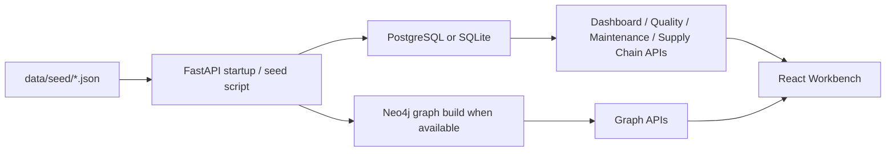

# Integration Guide

Last updated: 2026-05-21

This document explains the current integration surface for manufacturing data sources and pipelines. It separates implemented capabilities from planned connector ideas.

## 1. Current Integration Scope

Implemented now:

- Data source management API under `/api/v1/data-sources`.
- Pipeline API under `/api/v1/pipelines`.
- Scheduler API under `/api/v1/scheduler`.
- Seed-data based manufacturing demo data under `data/seed`.
- MES simulator code at `backend/app/services/data_integration/connectors/mes_simulator.py`.

Planned/reference only:

- ERP simulator.
- IoT simulator.
- PLC simulator.
- SCADA/LIMS connectors.
- Kafka/MQTT streaming connectors.
- OPC-UA/Modbus connectors.

Older documents may describe those planned connectors as if they already exist. Treat that wording as stale unless the corresponding file exists in `backend/app/services/data_integration/connectors/`.

## 2. Data Source API

Base path:

```text
/api/v1/data-sources
```

Current API surface:

```text
GET    /api/v1/data-sources
POST   /api/v1/data-sources
GET    /api/v1/data-sources/{source_id}
PUT    /api/v1/data-sources/{source_id}
DELETE /api/v1/data-sources/{source_id}
POST   /api/v1/data-sources/{source_id}/test
POST   /api/v1/data-sources/{source_id}/sync
GET    /api/v1/data-sources/{source_id}/status
GET    /api/v1/data-sources/{source_id}/preview
```

Example:

```bash
curl http://localhost:8000/api/v1/data-sources \
  -H "Authorization: Bearer <token>"
```

## 3. Pipeline API

Base path:

```text
/api/v1/pipelines
```

Current API surface:

```text
GET  /api/v1/pipelines
POST /api/v1/pipelines
GET  /api/v1/pipelines/{pipeline_id}
POST /api/v1/pipelines/{pipeline_id}/run
GET  /api/v1/pipelines/{pipeline_id}/runs
GET  /api/v1/pipelines/{pipeline_id}/runs/{run_id}
```

The current pipeline layer is suitable for demo and orchestration scaffolding. A future production integration should define a real job worker, retry policy, idempotency rules, lineage records, and connector-specific error handling.

## 4. Scheduler API

Base path:

```text
/api/v1/scheduler
```

Current API surface:

```text
GET    /api/v1/scheduler/jobs
POST   /api/v1/scheduler/jobs
PUT    /api/v1/scheduler/jobs/{job_id}
DELETE /api/v1/scheduler/jobs/{job_id}
POST   /api/v1/scheduler/jobs/{job_id}/trigger
```

## 5. Current Demo Data Flow



## 6. MES Simulator

Current implemented connector-like simulator:

```text
backend/app/services/data_integration/connectors/mes_simulator.py
```

Use it as the reference shape for future connector modules.

Recommended connector responsibilities:

- produce deterministic demo data where possible
- normalize output field names
- report status and errors clearly
- keep credentials out of source code
- expose a small interface that the pipeline engine can call

## 7. Planned Connector Categories

| Connector category | Status | Notes |
| --- | --- | --- |
| MES simulator | Implemented | `mes_simulator.py` exists. |
| ERP simulator | Planned | Document as future until code exists. |
| IoT simulator | Planned | Should be separate from seed `sensor_readings.json`. |
| PLC simulator | Planned | Should define equipment state/control parameter schema. |
| OPC-UA / Modbus | Planned | Requires real protocol libraries and security model. |
| MQTT / Kafka | Planned | Requires streaming ingestion and worker design. |
| File import | Planned | Should define CSV/XLSX schema validation and import history. |

## 8. Integration Design Rules

- Never write connector credentials into committed files.
- Treat external systems as unreliable: every sync needs timeout, retry, status, and error reporting.
- Keep raw payloads and normalized records separate.
- Route all ingested business data through an explicit mapping step.
- Do not silently create physical tables from external payloads.
- Prefer idempotent sync operations so repeated jobs do not duplicate records.

## 9. Relationship To Palantir Thinking

This layer corresponds to the Foundry-style data integration layer:

- external system connectors bring data in
- pipelines normalize and validate it
- ontology/semantic assets make it meaningful
- applications and workflows turn it into decisions and actions

The current repository implements the API and demo foundation. Production-grade connector execution is still a future implementation area.
